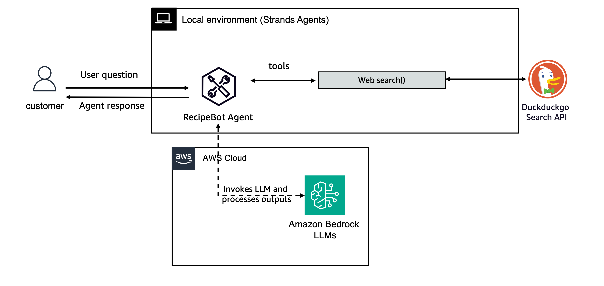

# Strands Agentsを始めよう

このガイドでは、Strands Agentsの基本概念を理解し、初めてのエージェントを作成して実行する方法を説明します。

## 前提条件

- Python 3.10以降
- 適切な権限で設定されたAWSアカウント
- Pythonプログラミングの基本的な理解

## インストール

pipを使用してStrands Agentsとツールパッケージをインストールします：

```bash
pip install strands-agents strands-agents-tools
```

## 基本概念

Strands Agentsは、AWSサービスと連携し、複雑なタスクを実行できるAIエージェントを構築するためのフレームワークです。主要なコンポーネントは以下の通りです：

1. **エージェント**: 会話を管理し、ツールを統制するコアコンポーネント
2. **モデル**: エージェントを動かす基盤となるLLM（大規模言語モデル）
3. **ツール**: エージェントが特定のタスクを実行するために使用できる関数
4. **セッションと状態**: やり取り間で会話履歴とエージェント状態を維持するメカニズム
5. **エージェントループ**: エージェントが入力を受け取り、処理し、応答を生成するプロセスフロー
6. **コンテキスト管理**: エージェントがメモリと検索を含む会話コンテキストを維持・管理する方法

## クイックスタートガイド

このディレクトリの`01-first-agent.ipynb`ノートブックは、以下のコード例を含む包括的なガイドを提供します：

1. **シンプルなエージェントの作成**: システムプロンプトを使用した基本エージェントの初期化方法を学習
2. **ツールの追加**: 組み込みツールとカスタムツールでエージェントを強化する方法を発見
3. **ログ設定**: デバッグと監視のための適切なログ設定
4. **エージェントのカスタマイズ**: 異なるモデルの選択とパラメータの設定

## サンプルの実行

このフォルダには、開始に役立つ入門ノートブックとシンプルなユースケースが含まれています：

1. **01-first-agent.ipynb**: 包括的なクイックスタートガイドとユースケースを含むJupyterノートブック。
ここでは以下を構築します：


そしてレシピエージェント：



2. **02-simple-interactive-usecase/**: CLIで実行するシンプルなインタラクティブ料理/レシピエージェントを含むディレクトリ。

インタラクティブエージェントを実行するには：

1. ディレクトリに移動: `cd 02-simple-interactive-usecase`
2. 要件をインストール: `pip install -r requirements.txt`
3. スクリプトを実行: `python recipe_bot.py`

## リソース

- より詳細なガイドについては[Strandsドキュメント](https://strandsagents.com/latest/user-guide/quickstart/)を参照
- [セッションと状態](https://strandsagents.com/latest/user-guide/concepts/agents/sessions-state)について詳しく学習
- [エージェントループ](https://strandsagents.com/latest/user-guide/concepts/agents/agent-loop/)を理解
- [コンテキスト管理](https://strandsagents.com/latest/user-guide/concepts/agents/context-management/)を深く学習
- 事前実装されたツールについては[strands-agents-tools](https://github.com/strands-agents/tools)リポジトリを確認
- システムプロンプトをカスタマイズし、関連ツールを追加して独自のタスク固有エージェントの構築を試行

Strands Agentsで楽しく構築しましょう！ 🚀
